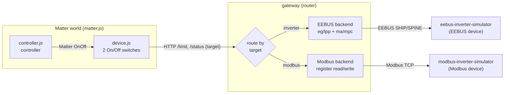

# EEBUS + Modbus Inverters with a Matter Routing Gateway

Two PV-inverter simulators speaking different field protocols (**EEBUS** and
**Modbus**), plus a **protocol-routing gateway** so a Matter controller (or plain
HTTP) can set/read each one's production limit **without knowing the protocol**.
The gateway routes every request to the right device by a `target`. Official
libraries: `enbility/eebus-go`, `simonvetter/modbus`, `matter.js`.

## Pieces

| Path | What it is |
| --- | --- |
| `cmd/eebus-inverter-simulator` | Inverter #1 — a real **EEBUS** device (`cs/lpp` + measurements) |
| `cmd/modbus-inverter-simulator` | Inverter #2 — a **Modbus TCP** device (holding + input registers) |
| `cmd/eebus-gateway` | Protocol-routing gateway: routes each request to `target` (EEBUS or Modbus); HTTP API |
| `matter-node/device.js` | Matter device with **two** On/Off switches (one per target) |
| `matter-node/controller.js` | Matter controller — commissions + interactive `<device> on/off` |
| `cmd/eebus-energyguard` | Optional: standalone EEBUS limit writer (no Matter) |

## Setup (once)

- Install **Go 1.22+** and **Node 20+**.
- Build Go: `go build ./...`
- Matter deps: `cd matter-node; npm install`

> Windows: if `go`/`node` aren't found, prepend them for the session:
> `$env:Path = "$env:ProgramFiles\Go\bin;$env:ProgramFiles\nodejs;$env:Path"`

## How it works

```text
                                     ┌─ target "inverter" ─EEBUS─▶ eebus-inverter-simulator
controller.js ─Matter▶ device.js ─HTTP▶ gateway ─┤
                                     └─ target "modbus"   ─Modbus─▶ modbus-inverter-simulator
```

- **Set a limit:** Matter `on` (or `POST /limit {target}`) → gateway routes to that device's protocol → it curtails.
- **Read live values:** `GET /status` → gateway reads each device (EEBUS `ma/mpc`, Modbus input registers) → JSON keyed by target.
- The Matter side never knows the field protocol — the gateway is the only place that speaks EEBUS/Modbus.

## Run it

Peers trust each other by **SKI** (printed on startup, saved in `.eebus/` /
`.gateway/`). Start 1 and 2, then copy each printed `ski=...` into the other's flag.

**1 — inverter** (note its `ski=...`)
```powershell
go run ./cmd/eebus-inverter-simulator -eebus-port 47711 -eebus-interface Wi-Fi -remote-ski <GATEWAY_SKI>
```

**2 — Modbus inverter** (no SKI, just a TCP port)
```powershell
go run ./cmd/modbus-inverter-simulator -modbus-url tcp://0.0.0.0:5502
```

**3 — gateway** (note its `ski=...`; HTTP on :8090; talks to both devices)
```powershell
go run ./cmd/eebus-gateway -eebus-port 47712 -eebus-interface Wi-Fi -inverter-ski <INVERTER_SKI> -modbus-url tcp://127.0.0.1:5502 -http 127.0.0.1:8090
```

You can already control both over HTTP now (pick the device with `target`):
```powershell
Invoke-RestMethod http://127.0.0.1:8090/status                                                                                    # read both devices
Invoke-RestMethod http://127.0.0.1:8090/limit -Method Post -ContentType application/json -Body '{"target":"modbus","watts":3000}'   # limit Modbus
Invoke-RestMethod http://127.0.0.1:8090/limit -Method Post -ContentType application/json -Body '{"target":"inverter","watts":4000}' # limit EEBUS
Invoke-RestMethod http://127.0.0.1:8090/limit -Method Post -ContentType application/json -Body '{"target":"modbus","reset":true}'   # clear Modbus
```

**4 — Matter device** (prints a pairing code)
```powershell
cd matter-node; node device.js
```

**5 — Matter controller** (commissions, then gives a prompt)
```powershell
cd matter-node; node controller.js
# matter> modbus on     -> Modbus device curtails to 3000 W
# matter> inverter on   -> EEBUS inverter curtails to 3000 W
# matter> status        -> show both switches
```

## Notes

- SKIs are printed on startup and persisted (`.eebus/`, `.gateway/`); reuse them next time.
- `mdns: Failed to set multicast interface` warnings are harmless. Both peers must be on the same LAN.
- Run the Go tests with `go test ./...`.

## Design

The project connects **Matter** (consumer smart-home) to energy devices that speak
different field protocols — here an **EEBUS** inverter and a **Modbus** inverter.
The gateway is a **protocol router**: the Matter side sends one command with a
`target`, and the gateway translates it to that device's protocol. Adding a third
protocol is just another backend behind the same HTTP API — the Matter side never
changes.



**What each part does**

- **eebus / modbus inverter** — two devices sharing one physics model (`internal/inverter`),
  each exposing it over its own protocol. The Matter/gateway side can't tell they're simulated.
- **gateway** — holds one `backend` per device behind a common interface
  (`SetLimit`/`Reset`/`Status`) plus a `map[target]backend`. `POST /limit {target}` and
  `GET /status` route to the right backend; the HTTP layer never mentions EEBUS or Modbus.
- **device.js** — exposes one Matter On/Off switch per target; each switch calls the gateway
  with its `target`. On startup each switch is aligned to its device's real state.
- **controller.js** — a Matter controller (chip-tool equivalent) with a `<device> on/off`
  prompt that drives either switch.

**The routing flow**

`controller: modbus on` → `device.js` (target `modbus`) → `POST /limit {target:"modbus"}`
→ gateway picks the Modbus backend → writes the holding register → the Modbus inverter
curtails. Typing `inverter on` instead routes the identical flow over EEBUS — no Matter-side change.

Because every tier speaks a standard protocol, the simulators could be replaced by real
EEBUS/Modbus hardware, or the controller by Apple Home / chip-tool, without code changes.
