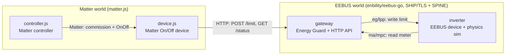

# EEBUS Inverter Simulator + Matter Gateway

A Go PV-inverter that runs as a **real EEBUS device**, plus a **Matter → EEBUS
gateway** so you can read live meter values and set a production limit — from
Matter or plain HTTP. All official libraries (`enbility/eebus-go`, `matter.js`).

## Pieces

| Path | What it is |
| --- | --- |
| `cmd/eebus-inverter-simulator` | The inverter — a real EEBUS device (`cs/lpp` + measurements) |
| `cmd/eebus-gateway` | Matter→EEBUS bridge: writes the limit (`eg/lpp`), reads the meter (`ma/mpc`), HTTP API |
| `matter-node/device.js` | Matter On/Off device — the Matter "face" of the limit |
| `matter-node/controller.js` | Matter controller — commissions the device, interactive `on/off` |
| `cmd/eebus-energyguard` | Optional: standalone EEBUS limit writer (no Matter) |

## Setup (once)

- Install **Go 1.22+** and **Node 20+**.
- Build Go: `go build ./...`
- Matter deps: `cd matter-node; npm install`

> Windows: if `go`/`node` aren't found, prepend them for the session:
> `$env:Path = "$env:ProgramFiles\Go\bin;$env:ProgramFiles\nodejs;$env:Path"`

## How it works

```text
controller.js ──Matter──▶ device.js ──HTTP──▶ gateway ──EEBUS──▶ inverter
```

- **Set a limit:** Matter `on` (or `POST /limit`) → gateway writes it over EEBUS → inverter curtails.
- **Read live values:** `GET /status` → gateway reads power / energy / frequency from the inverter over EEBUS.

## Run it

Peers trust each other by **SKI** (printed on startup, saved in `.eebus/` /
`.gateway/`). Start 1 and 2, then copy each printed `ski=...` into the other's flag.

**1 — inverter** (note its `ski=...`)
```powershell
go run ./cmd/eebus-inverter-simulator -eebus-port 47711 -eebus-interface Wi-Fi -remote-ski <GATEWAY_SKI>
```

**2 — gateway** (note its `ski=...`; HTTP on :8090)
```powershell
go run ./cmd/eebus-gateway -eebus-port 47712 -eebus-interface Wi-Fi -inverter-ski <INVERTER_SKI> -http 127.0.0.1:8090
```

You can already control it over HTTP now:
```powershell
Invoke-RestMethod http://127.0.0.1:8090/status                                                                  # read live values
Invoke-RestMethod http://127.0.0.1:8090/limit -Method Post -ContentType application/json -Body '{"watts":3000}'  # set 3000 W
Invoke-RestMethod http://127.0.0.1:8090/limit -Method Post -ContentType application/json -Body '{"reset":true}'  # clear
```

**3 — Matter device** (prints a pairing code)
```powershell
cd matter-node; node device.js
```

**4 — Matter controller** (commissions, then gives a prompt)
```powershell
cd matter-node; node controller.js
# matter> on     -> inverter curtails to 3000 W (mode=curtailed pvW=3000)
# matter> off    -> back to normal
# matter> status -> show on/off
```

## Notes

- SKIs are printed on startup and persisted (`.eebus/`, `.gateway/`); reuse them next time.
- `mdns: Failed to set multicast interface` warnings are harmless. Both peers must be on the same LAN.
- Run the Go tests with `go test ./...`.

## Design

The project bridges two standards — **Matter** (consumer smart-home) and **EEBUS**
(energy management) — so a Matter controller can **set** and **read** an EEBUS
inverter's production limit. Each layer uses the official library for its protocol
(`matter.js` for Matter, `enbility/eebus-go` for EEBUS), so the same setup would
interoperate with real devices.



**What each part does**

- **inverter** — a real EEBUS device. A small physics model generates PV power on a
  daylight curve; it publishes measurements and accepts an active-power production
  limit via the `cs/lpp` use case.
- **gateway** — an EEBUS Energy Guard. It **writes** the limit to the inverter
  (`eg/lpp`) and **reads** its live meter values (`ma/mpc`), exposing both through a
  tiny HTTP API (`POST /limit`, `GET /status`).
- **device.js** — the Matter representation of the limit switch. `on`/`off` map to
  `POST /limit`; on startup it reads `GET /status` and aligns the switch to the
  inverter's real state.
- **controller.js** — a Matter controller (the chip-tool equivalent): it commissions
  the device and offers an interactive `on/off/status` prompt.

**Two flows**

1. **Set the limit (write):** `controller on` → `device.js` → `POST /limit` → gateway
   `eg/lpp` → inverter curtails (`mode=curtailed pvW=3000`).
2. **Read the meter (read):** `GET /status` → gateway `ma/mpc` reads the inverter's
   live power / energy / frequency over EEBUS → JSON.

Because both sides speak standard protocols, swapping the simulator for a real EEBUS
inverter — or the controller for Apple Home / chip-tool — needs no code changes.
